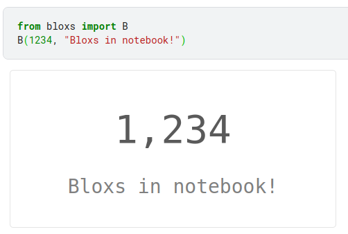
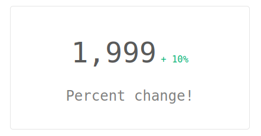
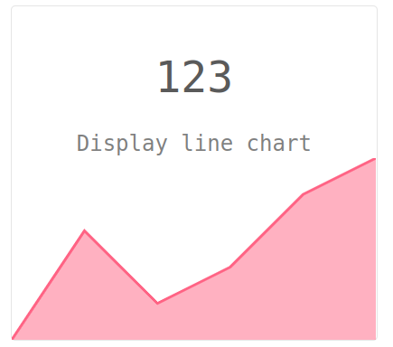

<p align="center">

</p>

# Bloxs

Bloxs is a simple python package that helps you display information in an attractive way (formed in blocks).

It works with: Jupyter Notebook, Google Colab, Deepnote, Kaggle Notebook, [Mercury](https://github.com/mljar/mercury).

## Get started

Install bloxs:

```
pip install bloxs
```

Import and create a bloxs
```
from bloxs import B
B(1234, "Bloxs in notebook!")
```



## Exmaples

| Bloxs | Code |
| --- | --- |
|  | ```B(1234, "Bloxs in notebook!")``` |
|  | `B(1999, "Percent change!", percent_change=10)` |
|  | `B("🎉🎉🎉", "Works with emojis")` |
|  | `B("68%", "Loading progress", progress=68)` |
|  | `B("68%", "Loading progress", progress=68, color="green")` color can be "blue", "red", "green" or custom in hex format (exmaple "#fa33fa") |
|  | `B("123", "Display line chart", points=[1,4,2,3,5,6])` |
|  | `B("123", "Display line chart", points=[1,4,2,3,5,6], color="red")` |
|  | `B("123", "Display stepped chart", points=[1,4,2,3,5,6], chart_type="stepped")` |
|  | `B("123", "Display bar chart", points=[1,4,2,3,5,6], chart_type="bar")` |
|  | `B("123", "Display bar chart", points=[1,4,2,3,5,6], chart_type="bar", color="green")` |


You can combine several bloxs in one row:

```
B([
    B(1999, "Percent change!", percent_change=10),
    B("🎉🎉🎉", "Works with emojis"),
    B("68%", "Loading progress", progress=68),
    B(1234, "Bloxs in notebook!")
])
```

 


```
B([
    B("786", "Display bar chart", points=[1,4,2,3,5,6], chart_type="bar", color="green"),
    B("123", "Display line chart", points=[1,4,2,3,5,6], color="red"),
    B("123", "Display stepped chart", points=[1,4,2,3,5,6], chart_type="stepped")
])
```

 

## Bloxs work great with Mercury

[Mercury](https://github.com/mljar/mercury) is a framework for converting notebook to interactive web app. It adds widgets to the notebook based on YAML config. Below is presented a notebook with bloxs and the same notebook served as web app with Mercury.

#### The notebook with bloxs


#### The Mercury web app


The web app is available on [our server](https://mercury.mljar.com/app/5) :computer:
